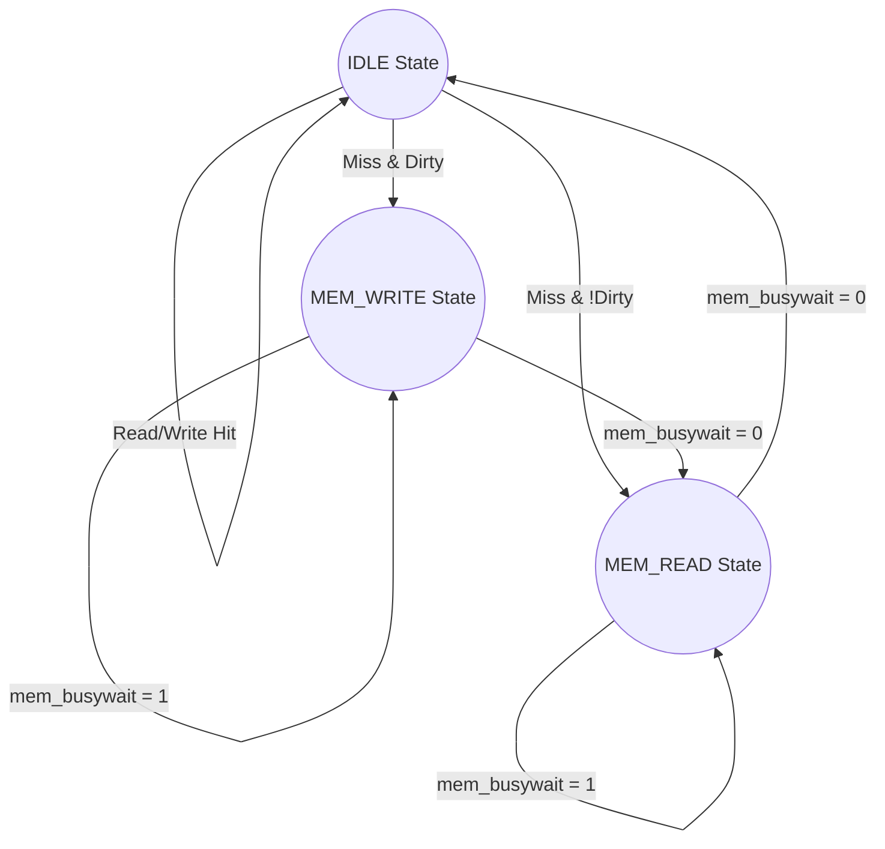

# Lab 6 - Cache Memory Answers

## 1. Handling Cache Misses (Read and Write)
In this memory hierarchy, we use a **Write-Back** policy with a **Write-Allocate** mechanism. 

When a **Cache Miss** occurs (either Read or Write), the following process happens:
1. **Dirty Bit Check:** The cache controller checks the `Dirty` bit of the currently indexed block. 
2. **Write-Back (If Dirty):** If the block is Dirty (`1`), the cache asserts the memory `WRITE` signal to write the modified block back to main memory. It waits until the memory `BUSYWAIT` is de-asserted. (This takes 20 CPU cycles).
3. **Memory Fetch:** Once write-back is complete (or if the block wasn't dirty), the cache asserts the memory `READ` signal to fetch the new missing block from main memory. It waits until the memory `BUSYWAIT` is de-asserted. (This takes another 20 CPU cycles).
4. **Cache Update:** The fetched block is written into the cache. The `Valid` bit is set to `1`. The `Tag` is updated. 
    * If it was a **Read Miss**: The `Dirty` bit is set to `0`. The requested word is sent to the CPU.
    * If it was a **Write Miss**: The `Dirty` bit is set to `1` (because the CPU immediately writes new data to it). The data from the CPU is written into the correct offset of the block.

### Flowchart for Cache Controller FSM

---

## 2. Cache Mapping Mechanism & Address Format
**Mechanism:** Direct Mapped Cache

Because the Data Memory fetches blocks of **4-Bytes**, we need 2 bits for the Offset. The remaining 6 bits of the 8-bit memory address are split between the Tag and the Index. Assuming a standard 8-block cache, we need 3 bits for the Index, leaving 3 bits for the Tag.

**8-bit Memory Address Format:**
| Tag (3 bits) | Index (3 bits) | Offset (2 bits) |
| :---: | :---: | :---: |
| Bits [7:5] | Bits [4:2] | Bits [1:0] |

---

## 3. Cache Table Trace
Let's trace the instructions to find the final state of the cache.
* `loadi 0 0x09` -> Reg 0 = `0x09`
* `loadi 1 0x01` -> Reg 1 = `0x01`
* `swd 0 1` -> Addr `0x01` (Tag `000`, Index `0`, Offset `1`). **Miss.** Fetch block. Write `0x09` at Offset 1. (Block 0 is now Dirty).
* `swi 1 0x00` -> Addr `0x00` (Tag `000`, Index `0`, Offset `0`). **Hit.** Write `0x01` at Offset 0.
* `lwd 2 1` -> Addr `0x01`. **Hit.** Reg 2 gets `0x09`.
* `lwd 3 1` -> Addr `0x01`. **Hit.** Reg 3 gets `0x09`.
* `sub 4 0 1` -> Reg 4 = `0x09` - `0x01` = `0x08`.
* `swi 4 0x07` -> Addr `0x07` (Tag `000`, Index `1`, Offset `3`). **Miss.** Fetch block. Write `0x08` at Offset 3. (Block 1 is now Dirty).
* `lwi 5 0x07` -> Addr `0x07`. **Hit.** Reg 5 gets `0x08`.
* `lwi 6 0x20` -> Addr `0x20` (Tag `001`, Index `0`, Offset `0`). **Miss.** Index 0 is currently Dirty! **Write-back Block 0 to memory.** Then fetch new block. Update Block 0 Tag to `001`. Set Dirty to `0`.
* `swi 4 0x20` -> Addr `0x20` (Tag `001`, Index `0`, Offset `0`). **Hit.** Write `0x08` at Offset 0. Set Dirty to `1`.

### Final Cache Table State
| Index (Dec) | Valid | Dirty | Tag (Bin) | Word 0 (Offset 0) | Word 1 (Offset 1) | Word 2 (Offset 2) | Word 3 (Offset 3) |
| :---: | :---: | :---: | :---: | :---: | :---: | :---: | :---: |
| **0** | 1 | 1 | `001` | `0x08` | *Mem* | *Mem* | *Mem* |
| **1** | 1 | 1 | `000` | *Mem* | *Mem* | *Mem* | `0x08` |
| **2 - 7** | 0 | 0 | `xxx` | - | - | - | - |
*(Note: "Mem" indicates the original unmodified data fetched from main memory).*

---

## 4. FSM Skeleton Completion
For the incomplete `Cache Controller FSM_incomplete.jpg` image, here are the exact transition rules you need to draw on the arrows:

**States:** `IDLE`, `MEM_READ`, `MEM_WRITE`

**Transitions from IDLE:**
* Arrow looping back to IDLE: `(read || write) && hit`
* Arrow pointing to MEM_WRITE: `(read || write) && !hit && dirty`
* Arrow pointing to MEM_READ: `(read || write) && !hit && !dirty`

**Transitions from MEM_WRITE:**
* Arrow looping back to MEM_WRITE: `mem_busywait == 1`
* Arrow pointing to MEM_READ: `mem_busywait == 0`

**Transitions from MEM_READ:**
* Arrow looping back to MEM_READ: `mem_busywait == 1`
* Arrow pointing to IDLE: `mem_busywait == 0`
